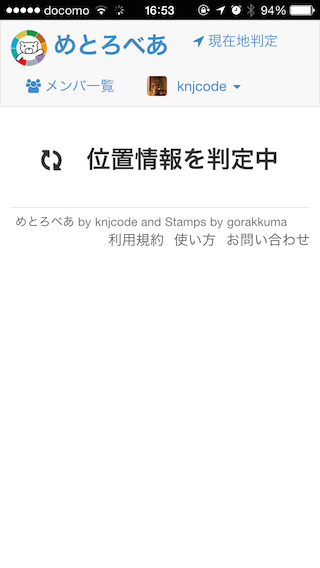
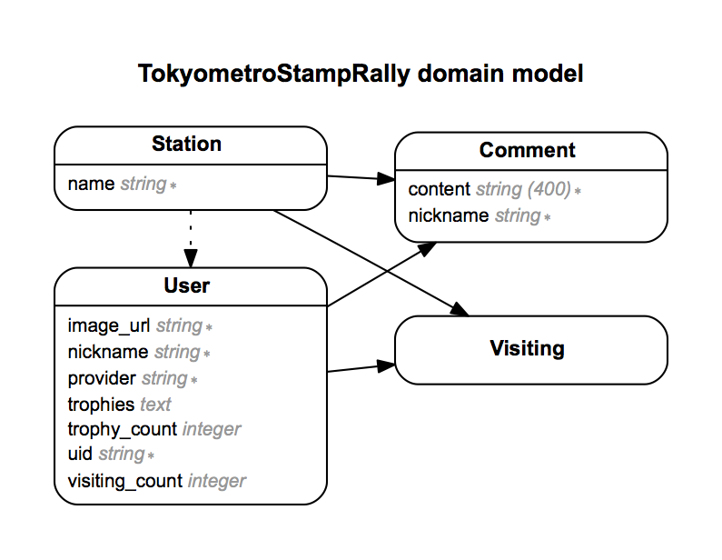

tokyometro-stamp-rally　[demo   on heroku](https://tokyometro-stamp-rally.herokuapp.com)
====

## 概要
東京メトロの[オープンデータ活用コンテスト](http://tokyometro10th.jp/future/opendata/index.html)
応募用に作成中のWebアプリです。  
アプリを実行しているモバイル端末等の位置情報をもとに東京メトロ各駅（全143駅）への訪問を記録できます。  
訪問済みの駅ごとに色々なスタンプ画像が用意されています。また、特定の駅の組み合わせを訪問した場合にはトロフィーが貰えます。

## 使い方
アプリのURLへアクセスしOAuth認証にてログイン後、位置情報判定を実施。  
東京メトロの駅にいる場合は、その駅への訪問が記録されスタンプ画像がゲットできます。

### 画面イメージ（＠iPhone5)
   

## 利用しているAPI

位置情報を渡すと近隣の東京メトロの駅（複数の場合あり）を返却してくれるAPIを利用する。
現在地からの有効半径を指定できるが現状は300mに設定している。
現状では、銀座と東銀座が同時に訪問できたりするが、あまりシビアにしすぎるのもストレスになるかも。

また、メトロの駅にいるときに使うため、必然的に地下で使うことが多くなるが、
GPSでの位置情報取得と相性が悪いという欠点が、、、  
Wifiを有効にしておけば、GoogleやApple様のおかげで位置情報の精度があがり、
なんとか使い物になっているという状況。  
地下を走行中に各駅停車ごとに判定するとだいたいOKだが、ときどき取得できない駅もあり、だいたい7割ぐたいの感覚。


## TODO

### 未実施
- ツイートボタン、いいねボタンの設置
- 各駅毎の情報をAPIで取得して表示
- メトロAPIの連続投入制限機能
- メトロAPI側エラーのハンドリング

### 実施中
- 各駅へのスタンプ画像の追加
- アプリの説明および問合せページ
- プライバシーポリシーの作成

### 実施済み
- 基本機能の実装
- アカウント削除機能
- twitterとfacebook認証によるユーザ名衝突の回避
- 駅来訪者一覧表示
- github認証
- 本番用ドメイン取得
- 退会リンクの色を他のところと変える
- Google Analyticsの導入
- 駅来訪記録の削除機能
- 自動訪問機能(環境変数TMSR_AUTO_VISITINGがtrueの場合に有効)
- トロフィー獲得時に通知をだす
- メンバ一覧を駅訪問数やトロフィー数でソートする
- これまでに訪問した駅一覧表示時に駅数分sql発行しているのを修正する
- アプリアイコンの追加
- ログイン時にアバターアイコンが変更されていれば反映するようにする
- 各種トロフィーの追加
- Userテーブルに駅訪問数のカラム追加
- 銀座線と半蔵門線のトロフィー判定がおかしい
- トロフィー毎の個別ページの作成
- 存在しないユーザIDを参照した場合にエラーを出す


## トロフィー

### トロフィーの実装方法
取得済みトロフィーの配列をユーザごとに持ち、シリアライズしてDBに保存する。  
トロフィーを更新するのは、ユーザ登録時・ログイン時・駅訪問時・駅訪問記録削除時のみ。  
ある程度、メンバ一覧やユーザ個別ページで不必要にDB検索が増えることを防げる。

### 実績一覧
- 全駅マスター  
  全143駅を訪問
- 各路線マスター
  路線ごとの全駅を訪問
- 新宿マスター（5駅）  
  西新宿、新宿、新宿三丁目、新宿御苑前、東新宿
- 代々木マスター（2駅）  
  代々木上原、代々木公園
- 谷マスター（11駅）  
  渋谷、南阿佐ケ谷、四谷三丁目、茗荷谷、神谷町、日比谷、入谷、市ヶ谷、四ツ谷、王子神谷、雑司が谷
- 門マスター（4駅）  
  虎ノ門、門前仲町、桜田門、半蔵門
- 寺マスター（3駅）  
  新高円寺、東高円寺、護国寺
- 町マスター（23駅）  
  末広町、稲荷町、田原町、方南町、中野富士見町、大手町、淡路町、神谷町、茅場町、人形町、小伝馬町、仲御徒町、門前仲町、東陽町、南砂町、町屋、要町、麹町、永田町、有楽町、新富町、神保町、錦糸町
- 丁目マスター（6駅）  
  青山一丁目、新宿三丁目、四ツ谷三丁目、本郷三丁目、銀座一丁目、六本木一丁目
- 5文字以上の駅マスター（17駅）  
  青山一丁目、上野広小路、中野富士見町、南阿佐ケ谷、新宿三丁目、新宿御苑前、四ツ谷三丁目、国会議事堂前、本郷三丁目、代々木上原、代々木公園、明治神宮前<原宿>、新御茶ノ水、地下鉄成増、地下鉄赤塚、銀座一丁目、六本木一丁目
- アニマルマスター（3駅）  
  虎ノ門、小伝馬町、高田馬場
- カラーマスター（14駅）  
  青山一丁目、赤坂見附、銀座、中目黒、東銀座、赤坂、新御茶ノ水、地下鉄赤塚、桜田門、銀座一丁目、目黒、白金台、白金高輪、赤羽岩淵
- 48駅目訪問（MTB48）
- 10駅目訪問
- 3駅目訪問
- アカウント登録


## 利用ライブラリ等
Ruby on Railsアプリをherokuにおいてる。

- アプリ本体
    - Ruby on Rails (言わずと知れたWebアプリ用フレームワーク)
    - Bootstrap (Webアプリ用のテンプレート集、レスポンシブ対応)
    - Font Awesome (Webアイコンフォント)
    - OmniAuth (簡単にOAuthを導入)
        - github認証
        - facebook認証
        - twitter認証
    - 東京メトロAPI (httpclientのgemで叩いてる)
- 監視・解析
    - New Relic (アプリ監視)
    - Google Analytics (アクセス解析)
- 動作環境
    - heroku
        - Zerigo DNSで独自ドメイン (metrobear.tokyo)


## 位置情報の取得
端末の位置情報はHTML5のGeolocation APIを利用し、javascriptを使って取得しています。  
位置情報判定ページでは、取得した位置情報をPOSTでサーバ送信し、駅訪問の判定をします。

## ER図
rails-erdというgemを使う  



Userモデルとメトロ各駅を登録したStationモデルがあり、駅の訪問はUserとStationに対して多対多の関係をもつVisitingモデルで管理する。  
駅訪問数や獲得トロフィーについてはUserモデルのカラムに値を保存して管理する。

## テスト

Rspecでやってる。  
RailsTutorial.jpのサンプルからそのまま持ってきたテストを大幅に簡略化していて、
各ページが表示されるかどうかぐらいしか見てない。もっと書いたほうが良い。


## 本番環境について

### herokuにデプロイ
herokuのアプリケーションをテスト用、本番用の2つ用意して使い分ける。

- ローカルテスト MacBookのローカル環境
- Webテスト heroku(tokyometro-stamp-rally.herokuapp.com)
- 本番環境 heroku(metrobear.herokuapp.com)

herokuデプロイ時の投げ分けはgitのpush先で切り替えるようにしている。

### ドメインの取得
独自ドメインとして metrobear.tokyo をムームードメインにて取得。  
アプリのURLは https://sr.metrobear.tokyo にする。  
将来の拡張のためにサブドメインを付けておく。  


### herokuへ独自ドメインを設定する
#### herokuアプリにZerigo DNSのアドオンを追加
```
$ heroku addons:add zerigo_dns
Adding zerigo_dns on metro... done, v6 (free)
Use `heroku addons:docs zerigo_dns` to view documentation.
```

#### herokuアプリにサブドメインを追加
```
$ heroku domains:add sr.metrobear.tokyo
Adding sr.metrobear.tokyo to metrobear... done
```

#### ムームードメイン側の設定変更
ムームードメインのDNS設定にてZerigo DNSのレコードを追加する。
コントロールパネルの「ネームサーバ設定変更」から「取得したドメインで使用する ※上級者向け」
のラジオボタンを選択し、以下の内容を登録する。
```
a.ns.zerigo.net
b.ns.zerigo.net
c.ns.zerigo.net
d.ns.zerigo.net
e.ns.zerigo.net
f.ns.zerigo.net
```
あわせて、ムームードメイン側でCNAMEレコードを追加する。
（sr.metrobear.tokyoからmetrobear.herokuapp.com
へリダイレクトされるようにする）

#### 参考
[herokuのカスタムドメイン設定](https://devcenter.heroku.com/articles/custom-domains#the-herokuapp-com-domain)


### 独自ドメインへのSSL(https)導入
月額5＄程度必要となるため、今回は利用しない。  
ログイン認証については、github、twitter、facebook、それぞれのリダイレクト先で通信暗号化された状態で認証されるので問題ない、と思う。

### OAuth認証の設定
github、twitter、facebook、それぞれの開発者サイトにて
認証に必要なAPIキーを取得する。

以下の計6つのAPIキーをherokuの環境変数に設定する。
```
TMSR_TWITTER_CONSUMER_KEY
TMSR_TWITTER_CONSUMER_SECRET
TMSR_FACEBOOK_APP_ID
TMSR_FACEBOOK_APP_SECRET
TMSR_GITHUB_CLIENT_ID
TMSR_GITHUB_APP_IDHUB_CLIENT_SECRET
```

### デプロイ先
herokuに上記独自ドメインを設定して運用する。


### アクセス解析
herokuのnewrelicアドオンおよびGoogle Analyticsを使用する。

#### newrelicアドオン

newrelicアドオンを追加し、ping設定してdynoが止まらないようにしておく。

#### Google Analytics
本番環境のみでGoogle Analyticsが動くようにしたいため。
環境変数 TMSR_GOOGLE_ANALYTICS_TRACKING_ID を作成し、
値が設定されていればアナリティクス用のコードをページに埋め込み、
値が無ければ何もしない用にする。
  
本番環境のみトラッキングIDをherokuの環境変数に設定する。
```
TMSR_GOOGLE_ANALYTICS_TRACKING_ID
```


## APIキー
東京メトロのオープンデータを利用するために必要となるAPIキーは第三者への公開が禁止されているため、
本アプリはAPIキーを環境変数(TMSR_ACCESS_TOKEN)から取得して動作します。

APIキーは下記のように設定します。

シェルでの設定例
```
$ export TMSR_ACCESS_TOKEN=w1xvatanovwev6af2qorchfw76a2jv3dx6crynvt02byht91ev5wxcawgzx2k414
```

herokuでの設定例
```
$ heroku config:add TMSR_ACCESS_TOKEN=w1xvatanovwev6af2qorchfw76a2jv3dx6crynvt02byht91ev5wxcawgzx2k414
Setting config vars and restarting tokyometro-stamp-rally... done, v21
TMSR_ACCESS_TOKEN: w1xvatanovwev6af2qorchfw76a2jv3dx6crynvt02byht91ev5wxcawgzx2k414
```

(APIキーはダミーです)

## License
MIT

## Author
[knjcode](https://github.com/knjcode) and Stamps by gorakkuma
